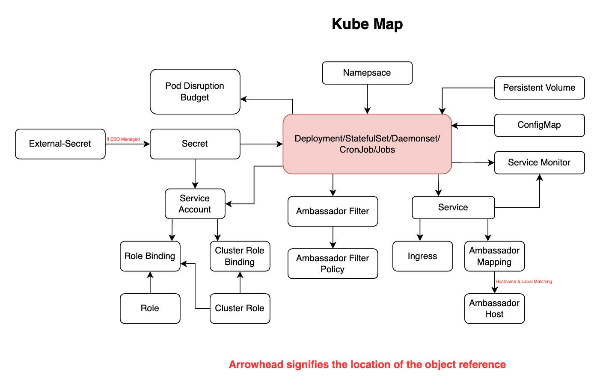

# Kube Map

A Python script capable of building logical relationships between kubernetes resources without ownerReferences, similar to [kubectl-tree](<https://github.com/ahmetb/kubectl-tree>) but capable of generating separate JSON files with all used resources for later processing.

# Resource mapping diagram


#### Note
In some cases, Jobs & Cronjobs are added to Deployment/StatefulSet/DaemonSet resource map if one of these conditions is met:
- Deployment name is the same as Cronjob/Job name
- Deployment and Cronjob/Job make use of the same configMap or Secret mounted as volume
- Deployment and Cronjob/Job make use of the same configMap or Secret as environment variable

If the above is not the case, the Cronjob/Job is threated as its one resource map.

# List of supported resources
- Deployment
- Statefulset
- Daemonset
- Cronjobs
- Jobs
- ConfigMap
- Persistent Volumes
- Secret
- [External Secret](<https://external-secrets.io/latest/>)
- Pod Disruption Budgets
- Service
- Ingress
- [Ambassador Mapping](<https://www.getambassador.io/docs/edge-stack/latest/topics/using/intro-mappings>)
- [Ambassador Filter](<https://www.getambassador.io/docs/edge-stack/latest/topics/using/filters>)
- [Ambassador Filter Policy](<https://www.getambassador.io/docs/edge-stack/latest/topics/using/filters>)
- [Ambassador Hosts](<https://www.getambassador.io/docs/edge-stack/latest/topics/running/host-crd>)
- Service Accounts
- Roles
- Role Binding
- Cluster Roles
- Cluster Role Bindings
- [Service Monitor](<https://github.com/prometheus-operator/prometheus-operator/tree/main>)

# Usage
## Exported kubernetes resources
Use the below command to export all resources to a JSON file.
```
kubectl get deployments.apps,statefulsets.apps,namespaces,daemonsets.apps,services,servicemonitor,serviceaccounts,rolebindings,clusterrolebindings,roles,clusterroles,persistentvolumeclaims,poddisruptionbudgets.policy,cronjobs.batch,jobs.batch,configmap,secrets,externalsecrets,ingress,mapping,hosts.getambassador.io,filterpolicies.getambassador.io,filters.getambassador.io -A -o json > kubernetes-resources.json
```
Copy the created file in the script directory.

## Config.json parameters
The script accepts the following parameters:

| Name                      | Description                                                                                                                                                                | Value   |
|---------------------------|----------------------------------------------------------------------------------------------------------------------------------------------------------------------------|---------|
| `skipNamespaces`          | List of namespaces. Resources in these namespaces are skipped                                                                                                              | `[]`    |
| `skipKinds`               | List of kubernetes resources we don't want to process                                                                                                                       | `[]`    |
| `skipSpecificDeployments` | List of deployment names to skip resource mapping                                                                                                                          | `[]`    |
| `skipDeploymentPrefix`    | List of deployment prefixes to skip resource mapping                                                                                                                       | `[]`    |
| `skipDeploymentSuffix`    | List of deployment suffixes to skip resource mapping                                                                                                                       | `[]`    |
| `includeVCTvolumes`       | Boolean, Include PVCs that were created by the volumeClaimTemplate within the deployment resource                                                                          | `false` |
| `skipIngressClassName`    | List of Ingress Class Names to skip, useful if for some reason you are stuck with two (old & new) nginx versions & would like to only link a specific one... ¯\_(ツ)_/¯    | `[]`    |
| `outputUnmappedResources` | Boolean, create a file containing eligible resources which were not mapped. a File per namespace is created for ease of readability                                        | `true`  |

Populate the config.json file as required to have the desired output

## Generating resource maps
Command to generate mapped JSON files in the output-dir folder:
```
python3 kube-map.py kubernetes-resources.json
```

## Generated file names:
| Name                                       | Description                                                                                             |
|--------------------------------------------|---------------------------------------------------------------------------------------------------------|
| `1.ambassador-External-Mappings.json`      | Contains Ambassador mappings which have an external HTTP/S backend service                              |
| `2.ambassador-Unmapped-Filters.json`       | Contains non 'External' Ambassador filters which cant be mapped to a kubernetes resource service        |
| `3.global-UNMAPPED-Resources.json`         | If `outputUnmappedResources` is set to true, will contain all eligible resources which were not mapped  |
| `<namespace>-<deployment name>.json`       | Deployment/Statefulset/Daemonset mapped resources JSON file                                             |
| `<namespace>-<job name>-job.json`          | Standalone Cronjob mapped resources JSON file                                                           |
| `<namespace>-<cronjob name>-cronjob.json`  | Standalone Job mapped resources JSON file                                                               |
